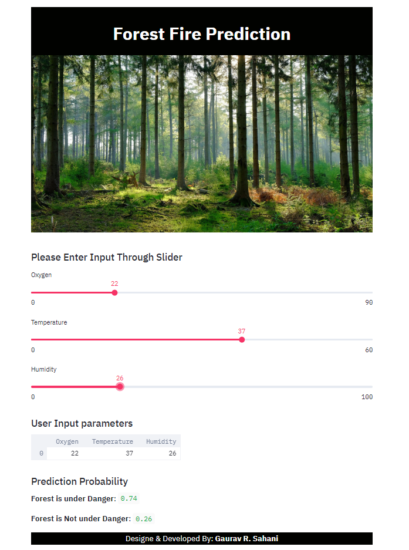

# Forest-Fire-Prediction-Streamlit-application

### This Application, gives the predfiction whether the Forest is safe or Un-Safe from Fire Occurance, depending on the features like Temperature, Humidity and Oxygen Content in Air, Used the basic Decision Tree Classfier to train the model, Later used the streamlit library and Flask Framework for the deployment Purposes on Heroku, which is the Cloud Platform as a Service.

## Website Link: https://forestfireapp.herokuapp.com/

